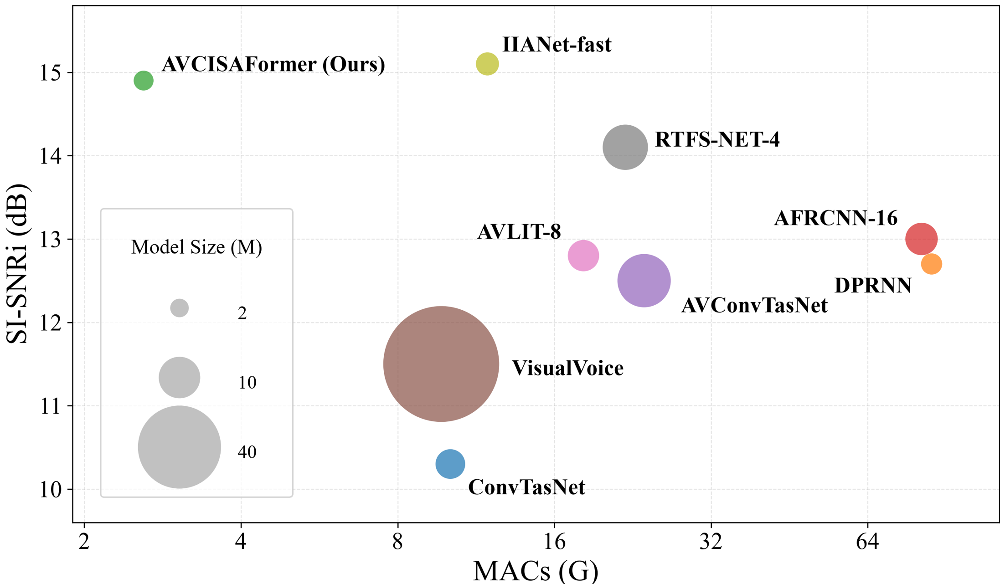

<h1 align="center">AVCISAFormer</h1>

<h3 align="center">
  Efficient Audio-Visual Speech Separation via Adaptive Cross-Modal Fusion and Multi-Scale Sequence-Aware Modeling
</h3>

  
  

  <a href="#overview">Overview</a> •
  <a href="#demo">Demo</a> •
  <a href="#network-architecture">Network Architecture</a> •
  <a href="#performance-and-efficiency">Performance and Efficiency</a> •
  <a href="#source-code">Source Code</a> •
  <a href="#contact">Contact</a>

---

## Overview

Overlapping speech makes it difficult to recover a target speaker’s voice and can undermine the reliability of downstream speech applications. Visual cues provide complementary information for distinguishing speakers, but effectively integrating audio-visual representations while keeping computational costs low remains challenging.

We introduce **AVCISAFormer**, an efficient audio-visual speech separation model built around **adaptive cross-modal fusion** and **multi-scale sequence-aware modeling**. Its two core components address complementary aspects of the separation process:

- **Adaptive Cross-Modal Fusion Block (AVCFB):** Uses learnable queries to aggregate shared memory from joint audio-visual representations, enabling efficient cross-modal fusion while preserving modality-specific representations.
- **Multi-Scale Sequence-Aware Block (MSAB):** Captures local details and global context while modeling temporal dependencies and channel-wise relationships.

Experiments on multiple datasets demonstrate strong separation performance with a computational cost of only **2.6 G MACs**, supporting a favorable balance between separation quality and efficiency.

---

## Demo

This video demonstrates the speech separation performance of AVCISAFormer on real-world recordings.

<!-- 在下方单独一行粘贴 GitHub 生成的视频附件链接，链接须放在注释外。 -->

---

## Network Architecture

  

  <em>Overview of AVCISAFormer, featuring adaptive cross-modal fusion and multi-scale sequence-aware modeling.</em>

### Adaptive Cross-Modal Fusion Block

Effective audio-visual separation requires both the integration of complementary cues and the preservation of information specific to each modality.

The **Adaptive Cross-Modal Fusion Block (AVCFB)** employs learnable queries to aggregate shared memory from joint audio-visual representations. This mechanism enables the model to integrate information across modalities while retaining their distinct representations, supporting efficient cross-modal modeling.

### Multi-Scale Sequence-Aware Block

Speech separation requires sensitivity to fine-grained signal details as well as broader contextual information.

The **Multi-Scale Sequence-Aware Block (MSAB)** combines local and global modeling with temporal and channel-wise dependency modeling. These complementary perspectives enrich sequence representations and help the model distinguish target speech from interfering sources.

---

## Performance and Efficiency

AVCISAFormer is evaluated on multiple audio-visual speech separation datasets. The following visualization compares separation performance, computational complexity, and model size across methods.

  

  <em>Performance–efficiency comparison. The horizontal axis denotes MACs, the vertical axis denotes SI-SNRi, and bubble size represents the number of model parameters.</em>

AVCISAFormer achieves superior separation performance with only **2.6 G MACs**, benefiting from its lightweight architecture and efficient fusion and separation design. To the best of our knowledge, it has the lowest computational complexity among existing audio-visual speech separation models with comparable separation performance.

---

## Source Code

> [!NOTE]
> The source code will be released soon. Updates and usage instructions will be provided in this repository.

---

## Contact

For questions about AVCISAFormer, please open an issue in this repository.

---

  If this work is useful to your research, please consider giving this repository a ⭐.

