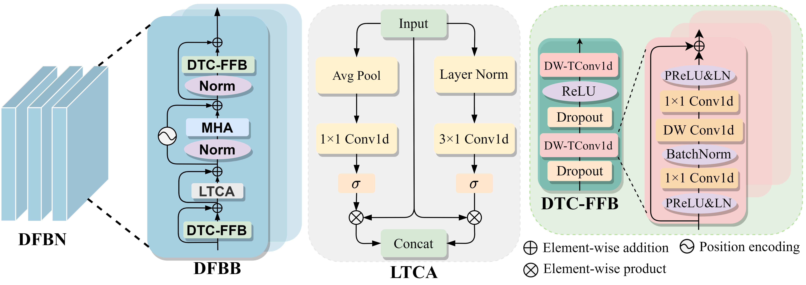
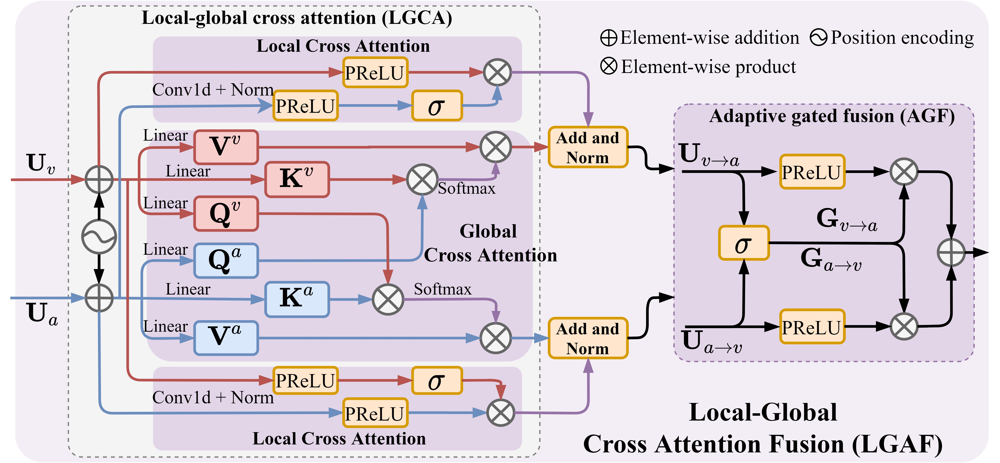

<h1 align="center">AVFuseFormer</h1>

  <b>Audio-Visual Fusion and Sequence Modeling with LGAF and DFBN for Efficient Speech Separation</b>

  An efficient audio-visual speech separation framework that integrates the
  <b>Local–Global Audio-Visual Fusion module (LGAF)</b> and the
  <b>DTC-FFBFormer Network (DFBN)</b>.

  

---

## Overview

AVFuseFormer is a computationally efficient audio-visual speech separation framework designed to effectively exploit complementary audio and visual information. It incorporates:

- **LGAF**, which models dynamic cross-modal interactions and adaptively integrates complementary audio-visual information.
- **DFBN**, which jointly captures local and global contexts, temporal dependencies, and channel-wise relationships.
- A **hierarchical encoder–decoder architecture**, which integrates multimodal fusion and sequence modeling for efficient speech separation.

---

## Network Architecture

### AVFuseFormer

  

  <em>Overall architecture of the proposed AVFuseFormer.</em>

### Core Modules

<table>
  <tr>
    <td align="center" width="50%">
      <b>DFBN Network</b>
    </td>
    <td align="center" width="50%">
      <b>LGAF Module</b>
    </td>
  </tr>

  <tr>
    <td align="center" valign="middle" width="50%">
      
    </td>
    <td align="center" valign="middle" width="50%">
      
    </td>
  </tr>

  <tr>
    <td align="center" valign="top">
      <em>
        Architecture of the DTC-FFBFormer Network used in DFBN.
      </em>
    </td>
    <td align="center" valign="top">
      <em>
        Architecture of the Local–Global Audio-Visual Fusion module.
      </em>
    </td>
  </tr>
</table>

---

## Real-World Demonstration

To evaluate the effectiveness of AVFuseFormer on real-world audio-visual speech data, we test the model using several video recordings collected from YouTube. Each recording contains overlapping speech from two speakers under different facial poses and head-motion conditions.

### Demo Video

https://github.com/user-attachments/assets/96e16abe-bd4e-4187-a4cc-caf40e977b46

### Full Demo Collection

The complete set of real-world separation demonstrations is also available for viewing and download via Google Drive.

  <a href="https://drive.google.com/file/d/1m22oktrv1XFLONPhJP4qVx8hhl706oTi/view?usp=drive_link">
    <b>▶ Access and Download the Full Demo via Google Drive</b>
  </a>

### Demo Conditions

| Videos | Facial pose and motion |
| :----: | :--------------------- |
| 1–2 | The speakers mainly maintain frontal facial poses. |
| 3–5 | The speakers exhibit varying degrees of side-facing poses and head motion. |

These examples demonstrate the effectiveness of AVFuseFormer under both relatively controlled frontal-view conditions and more challenging scenarios involving pose variations and head movements.

---

## Source Code

> [!NOTE]
> The source code and pretrained models will be made publicly available upon acceptance of the paper. Please stay tuned for future updates.

---

## Contact

For questions or issues related to this work, please open an issue in this repository.
