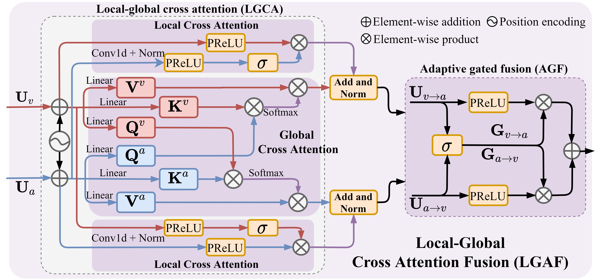

<h1 align="center">AVFuseFormer</h1>

<p align="center">
  <b>Audio-Visual Fusion and Sequence Modeling with LGAF and DFBN for Efficient Speech Separation</b>
</p>

<p align="center">
  An efficient audio-visual speech separation framework that integrates the
  <b>Local–Global Audio-Visual Fusion module (LGAF)</b> and the
  <b>DTC-FFBFormer Network (DFBN)</b>.
</p>

<p align="center">
  
</p>

---

## Overview

AVFuseFormer is a computationally efficient audio-visual speech separation framework designed to effectively exploit complementary audio and visual information. It incorporates:

* **LGAF**, which establishes dynamic cross-modal interactions and adaptively aggregates complementary audio-visual information.
* **DFBN**, which models local and global contexts together with temporal and channel-wise dependencies.
* A **hierarchical encoder–decoder architecture**, which integrates multimodal fusion and sequence modeling for efficient speech separation.

---

## Network Architecture

### AVFuseFormer

<p align="center">
  
</p>

<p align="center">
  <em>Overall architecture of the proposed AVFuseFormer.</em>
</p>

### Core Modules

<table>
  <tr>
    <td align="center" width="50%">
      <b>DFBN Network</b>
    </td>
    <td align="center" width="50%">
      <b>LGAF Module</b>
    </td>
  </tr>

  <tr>
    <td align="center" valign="middle">
      
    </td>
    <td align="center" valign="middle">
      
    </td>
  </tr>

  <tr>
    <td align="center" valign="top">
      <em>
        Architecture of the DTC-FFBFormer Network used in DFBN.
      </em>
    </td>
    <td align="center" valign="top">
      <em>
        Architecture of the Local–Global Audio-Visual Fusion module.
      </em>
    </td>
  </tr>
</table>

---

## Real-World Demonstration

To evaluate the effectiveness and robustness of AVFuseFormer on real-world audio-visual speech data, we test the model using several video recordings collected from YouTube. Each recording contains overlapping speech from two speakers under different facial poses and motion conditions.

### Demo Video 1

https://github.com/user-attachments/assets/f6a8ff1f-4990-405f-adc1-5f523dd0a7c1

### Demo Video 2

https://github.com/user-attachments/assets/7a91c34f-f0cb-4c30-b737-7e9c1a9a1fc9

### Demo Video 3

https://github.com/user-attachments/assets/8fc10c1e-7b1d-4708-93d9-aef114d46d1c

### Full Demo Collection

Additional real-world separation examples are available through Google Drive.

<p align="center">
  <a href="https://drive.google.com/file/d/1yPaKq7BkdNy8Y7hWri46jpeZp4SsROaY/view?usp=sharing">
    <b>▶ View the Full Real-World Demo on Google Drive</b>
  </a>
</p>

### Demo Conditions

| Videos | Facial pose and motion                                                     |
| :----: | :------------------------------------------------------------------------- |
|   1–2  | The speakers mainly maintain frontal facial poses.                         |
|   3–5  | The speakers exhibit varying degrees of side-facing poses and head motion. |

These examples demonstrate the separation capability of AVFuseFormer under both relatively controlled frontal-view conditions and more challenging scenarios involving pose variations and head movements.

---

## Source Code

> [!NOTE]
> The source code and pretrained models will be made publicly available upon acceptance of the paper. Please stay tuned for future updates.

---

## Citation

If this work is useful for your research, please consider citing our paper:

```bibtex
@article{AVFuseFormer,
  title   = {AVFuseFormer: Audio-Visual Fusion and Sequence Modeling with LGAF and DFBN for Efficient Speech Separation},
  author  = {Author names},
  journal = {Journal name},
  year    = {2026}
}
```

---

## Contact

For questions regarding this work, please open an issue in this repository.
